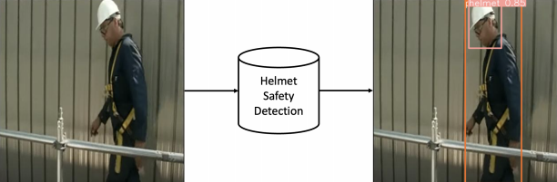
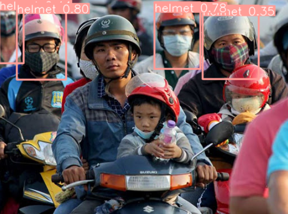

# Working-Safety-Monitoring-Using-Yolov10-High-level-Object-detection
# YOLOv10 Helmet Safety Detection
<p align="center">
  
</p>
This project aims to detect workers wearing safety helmets using the YOLOv10 model. The project involves setting up the environment, using pre-trained models, and fine-tuning YOLOv10 on a custom dataset.

## Table of Contents
1. [Introduction](#introduction)
2. [Setup](#setup)
3. [Pre-trained Model Usage](#pre-trained-model-usage)
4. [Fine-tuning YOLOv10](#fine-tuning-yolov10)
5. [FAQ](#faq)

## Introduction
This project uses YOLOv10 for object detection, specifically focusing on detecting helmets on construction workers. It outputs the coordinates (bounding boxes) of detected workers and helmets in an image.

## Setup
1. **Google Colab**: This project uses Google Colab for code execution.
   - Visit [Google Colab](https://colab.research.google.com).
   - Sign in with your Google account.
   - Create a new notebook and switch the runtime to GPU.

2. **Clone YOLOv10 Repository**:
   ```bash
   !git clone https://github.com/THU-MIG/yolov10.git
    ```
3. **Install required libraries**:
    ```
    %cd yolov10
    !pip install -q -r requirements.txt
    !pip install -e .
    ```
## Pre-trained model usage
1. **Download Pre-trained Model**:
    ```
    !wget https://github.com/THU-MIG/yolov10/releases/download/v1.1/yolov10n.pt
2. **Initialize model**:
    ```
    from ultralytics import YOLOv10
    MODEL_PATH = 'yolov10n.pt' 
    model = YOLOv10(MODEL_PATH)
3. **Run Predictions on an Image**:
    ```
    IMG_PATH = './images/HCMC_Street.jpg'
    result = model(source=IMG_PATH)[0]
4. **Save Prediction Results**:
    ```
    result.save('./images/HCMC_Street_predict.png')
## Fine-tuning (Training for new data)
1. **Download and prepare dataset**:
    ```
    !gdown '1twdtZEfcw4ghSZIiPDypJurZnNXzMO7R'
2. **Download and unzip into the appropriate directory**:
    ```
    !gdown '1twdtZEfcw4ghSZIiPDypJurZnNXzMO7R'
    !mkdir safety_helmet_dataset
    !unzip -q '/content/yolov10/yolov10/yolov10/Safety_Helmet_Dataset.zip' -d '/content/safety_helmet_dataset'
3. **Train YOLOv10**:
     ```
    YAML_PATH = '../safety_helmet_dataset/data.yaml'
    EPOCHS = 50
    IMG_SIZE = 640
    BATCH_SIZE = 256
    model.train(data=YAML_PATH, epochs=EPOCHS, batch=BATCH_SIZE, imgsz=IMG_SIZE)
4. **Evaluate the model**:
    ```
    TRAINED_MODEL_PATH = 'runs/detect/train/weights/best.pt'
    model = YOLOv10(TRAINED_MODEL_PATH)
    model.val(data=YAML_PATH, imgsz=IMG_SIZE, split='test')
## Result: Picture with bounding box
<p align="center">
  
</p>


